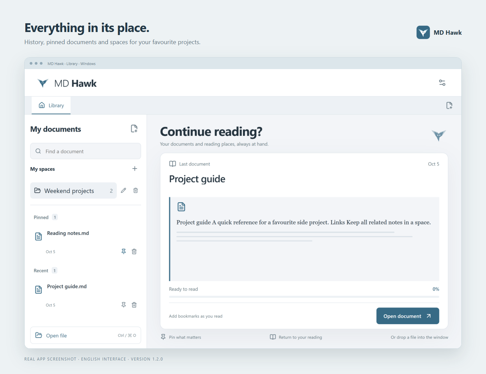
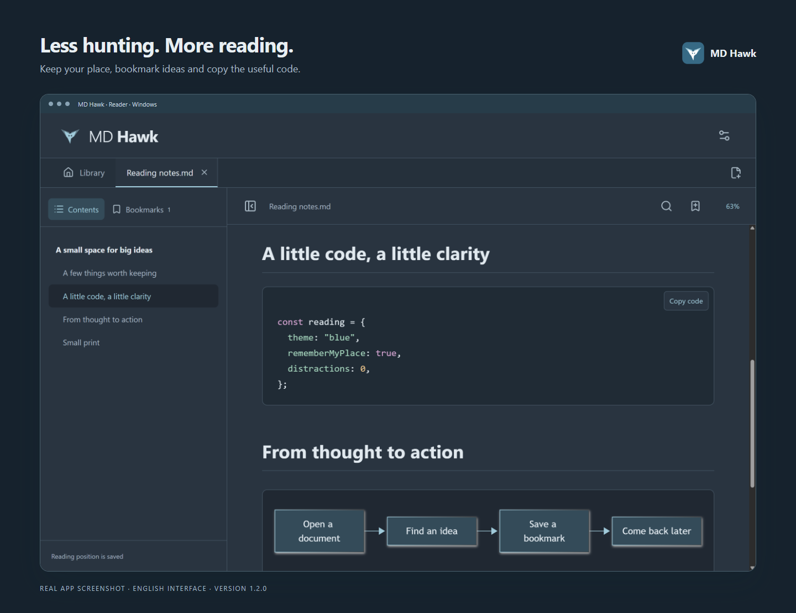

# MD Hawk

**A cosy desktop reader for Markdown, PDF and Word.**

I built this for myself: a quiet place to read my notes and pick up where I left off. If it helps you too, you're welcome to use it, share it or improve it.

**v1.2.0** · **16 languages** · **GNU GPLv3+** · No accounts or cloud sync.

[Download for Windows](https://github.com/AlexiAxAxA/md-hawk/releases/tag/v1.2.0) · [Version history](CHANGELOG.md) · [Report a bug](https://github.com/AlexiAxAxA/md-hawk/issues)

## What it does

- Opens `.md`, `.markdown`, `.mdown`, `.pdf` and `.docx`.
- Keeps history, pinned documents, draggable tabs and document groups called **spaces**.
- Remembers your reading position, optionally; manual bookmarks work either way.
- Renders tables, code, images, footnotes, KaTeX formulas and Mermaid diagrams.
- Copies code with one click; selects whole lines from the right margin in Markdown/DOCX.
- Offers six themes, custom colours, fonts, spacing and **8–40 px** text. Reset without losing your library.

Your library stays on your computer. Removing a history entry never deletes the original file.

## A look inside





*Real screenshots from the Windows app, with an English interface and demo documents.*

## Quick install

### Windows

Download the [installer](https://github.com/AlexiAxAxA/md-hawk/releases/download/v1.2.0/MD-Hawk-1.2.0-x64-nsis.exe), run it and choose your language. Prefer no installation? Use the [portable EXE](https://github.com/AlexiAxAxA/md-hawk/releases/download/v1.2.0/MD-Hawk-1.2.0-x64-portable.exe).

Windows x64 is tested. Builds are unsigned, so Windows may show a warning. [SHA256 checksums](https://github.com/AlexiAxAxA/md-hawk/releases/download/v1.2.0/SHA256SUMS-v1.2.0.txt) are included. The installer offers 15 languages; all 16, including Bengali, are available in Settings. Updates preserve your preferences.

### Linux & macOS

No prebuilt releases yet. With **Git and Node.js 24+**, run from source:

```sh
git clone https://github.com/AlexiAxAxA/md-hawk.git
cd md-hawk
npm ci
npm run dev
```

To create a package, build **on the corresponding OS**:

| Platform | Command | Output |
| --- | --- | --- |
| Windows | `npm run dist:win` | Installer + portable EXE |
| Linux | `npm run dist:linux` | AppImage + DEB |
| macOS | `npm run dist:mac` | DMG |

Packaging is configured for all three platforms; **Linux/macOS builds and launches are not yet verified**. Run `npm run licenses` before packaging after changing dependencies. Outputs go into `release/`.

## Handy keys

**Ctrl / Cmd** + **O**: open · **F**: find · **D**: bookmark · **W**: close tab · **,**: settings.

Drag a file into the window to open it. Select another language in Settings. Regular launches show the library; opening a file through the system goes straight to that document.

## A few honest limits

This is a reader: no editing, export, sync or automatic updates. Old `.doc` files need conversion to `.docx`; Word layout may differ. PDF bookmarks save the page; password entry and OCR are not supported. Translations haven't been reviewed by native speakers yet.

Validation for v1.2.0: **18 logic tests, 15 installed-Windows UI tests and a portable launch check passed**. Run `npm test`, `npm run build` and `npm run test:e2e` locally. [Detailed project docs](docs/index.md) are currently in Russian.

## License

Copyright 2026 MD Hawk contributors. Free software under **[GNU GPL version 3 or later](LICENSE)**, without warranty. Dependencies retain their own licenses; see [third-party notices](THIRD-PARTY-NOTICES.txt).

Made for my own reading habit. Shared for yours. 🦅
