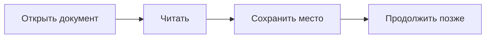

# Добро пожаловать в MD Hawk

Удобное место для чтения Markdown. Ваши документы остаются на диске, а MD Hawk хранит историю открытий, закладки и место чтения на этом компьютере.

## Быстрый старт

1. Откройте документ кнопкой **«Открыть файл»** или перетащите его в окно.
2. Читайте сразу несколько файлов во вкладках.
3. Нажмите значок закладки, чтобы отметить текущий абзац.
4. Вернитесь на домашний экран и нажмите **«Продолжить чтение»**.

Слева находятся [оглавление](#оглавление-и-ссылки) и закладки. В настройках можно выбрать тему, размер текста, ширину колонки и режим запоминания.

## Оглавление и ссылки

Клик по заголовку в оглавлении переносит к разделу. Ссылки внутри Markdown тоже работают: [настройки](#настройки), [горячие клавиши](#горячие-клавиши), [документация проекта](../README.md).

Внешние ссылки открываются в вашем браузере. Ссылка на другой локальный MD открывает вкладку MD Hawk.

## Настройки

| Настройка | Что меняет |
|---|---|
| Тема | Оформление интерфейса и документа |
| Размер текста | Размер шрифта в читалке |
| Ширина колонки | Удобную длину строки |
| Запоминать место чтения | Автоматическое возвращение к последнему месту |

> Ручные закладки работают, даже если автоматическое запоминание выключено.

Доступны светлая, тёмная, две монохромные темы, сепия и синяя тема.

## Горячие клавиши

На macOS используйте Cmd вместо Ctrl.

- **Ctrl+O** — открыть файл.
- **Ctrl+F** — найти текст.
- **Ctrl+D** — поставить закладку.
- **Ctrl+W** — закрыть вкладку.
- **Ctrl+,** — открыть настройки.

## Форматирование

MD Hawk показывает **жирный текст**, *курсив*, `код`, таблицы, картинки, сноски[^note] и списки задач.

- [x] Открыть первый файл.
- [ ] Выбрать любимую тему.
- [ ] Закрепить полезный документ.

```typescript
const reading = {
  document: 'Добро пожаловать.md',
  bookmarks: true,
  rememberPosition: true,
};
```

Формулы работают прямо в тексте: $E = mc^2$.

$$
\int_0^1 x^2\,dx = \frac{1}{3}
$$



## Если файл переместился

Откройте библиотеку и выберите **«Указать новое расположение»**. Выберите тот же документ на новом месте — его закладки и сохранённая позиция останутся в истории.

**«Убрать из истории»** удаляет только запись MD Hawk. Исходный файл остаётся на диске.

[^note]: Можно перейти к сноске и вернуться обратно по ссылке.
